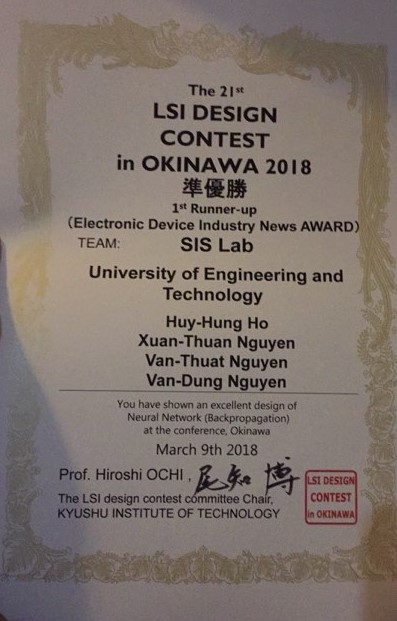

<!---
/*******************************************************************************
// Project name   : Ann (Artificial neural network)
// File name      : README.md
// Created date   : Thu 28 Sep 2017 03:50:15 PM ICT
// Author         : Huy-Hung Ho
// Last modified  : Mar 20 2021 01:18
// Desc           :
*******************************************************************************/
-->

# Introduction

The SISLAB team in LSI Design Contest 2018.

Design challenge: "Neural Network (Backpropagation)"

The goals of project is learning about neural network, the flow from algorithm to
hardware architecture, having an result.

# Dir architecture

-   ann_core 	: Main project architecture
-   doc 		: document, presentation, reference..
-   impl 		: hardware implementation results (using Vivado)
- 	sc 			: stochastic algorithm to optimization

# Useful links

- [Important information](PLAN.md)
- [PDF report](PAPER-SISLAB_team_2018.pdf)
- [PPTX report](SLIDE-SISLAB_team_2018.pptx)
- [Contest website](http://www.lsi-contest.com/2018/index_e.html)

# Contest result

Obtaining 1st Runner-up award in LSI Design Contest 2018. YOLO

