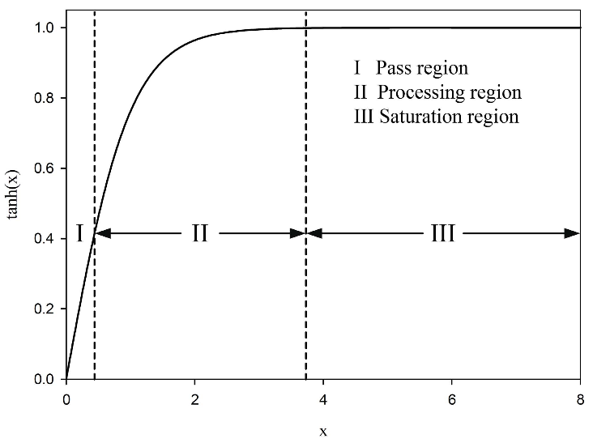

<!---
/*******************************************************************************
// Project name   :
// File name   	  : review.md
// Created date   : Mon 23 Oct 2017 02:52:30 PM ICT
// Author     	  : Huy-Hung Ho
// Last modified  : Mon 23 Oct 2017 02:52:30 PM ICT
// Desc       	  :
*******************************************************************************/
-->
# biradar2015 - FPGA Implementation of a Multilayer Artificial Neural Network using System-on-chip Design Methology

## Intro
Area-optimized implementation, co kha nang mo rong.

Using hyperbolic tangent activation function (tanh()).

We present a real-time embedded hardware implementation of a feed-forward neural network which employs backpropagation algorithm for training. 

Custom modules are designed for the activation functions, the neurons and a finite state machine that co-ordinate activities for training.

- SW:   ineffective due to large latency of training on the host processor
- HW:   parallelism,  pipelining and flexible bit width data path
- ASIC: prohibitively costly and dedicated to a specific ANN model.
- FPGA: flexibility in programmable systems, parallelism which allows faster operation, high logic density, ability to reconfigure while resident on the system, inexpensive logic design due to their shorter design cycle and hardware reuse. 

The main contributions:
- (i) A custom hardware module for efficient approximation of hyperbolic tangent activation function.
- (ii) Hardware abstraction of neuron along with necessary data path and communication ports as a parametrizable intellectual property (IP).
- (iii) Complete custom hardware implementation of backpropagation algorithm for training a candidate four-layer feed-forward neural network (FFNN)

# gomperts2011 - Development and Implementation of Parameterized FPGA-Based General Purpose Neural Networks for Online Applications

## Intro

High degree of parameterization (tham so hoa)

Using LUT for activation function

# ortegazamorano2015 - Efficient Implementation of the Backpropagation Algorithm in FPGAs and Microcontroller

BP algorithm in a Virtex-5 and an Arduino Dua microcontroller

Reduces drastically (tram trong) the resuorce usage by combining (??)

A time-divisoin multiplexing for carrying out product computation using DSP

Floating-point datat type changed more efficient on based on a fixed-point, resucing system memory  variable usage and leading to an increase in computation speed.

Main contribution:
	- to obtain efficient implementations on both types of devices that permit its practical application in real-life problems
	- to compare the efficiency between them and to a standard PC-based implementation

# zamanlooy2014 - Efficient VLSI Implementation of Neural Networks

The main  building blocks need ed for hardware implemen- tation of neural networks are multiplier, adder, and nonlinear activation function

Activation function approximate:
-   piecewise  linear  approximation  (PWL)
-  	piecewise  nonlinear approximation
-   lookup  table  (LUT)
-   bit-level  mapping
-   hybrid methods
- 	CRI-based method: a PWL without multiplier

Proposed design based on linear apprximattion and bit-level mapping

There are 3 region:
	

## hunter2012 - Selection of Proper Neural Network Sizes and
 
## napoli2014 - Reduced Complexity Digital Back-Propagation
 
## ortegazamorano2014 - FPGA Implementation of the C-Mantec Neural
 
## Shoushan2010 - A Single Layer Architecture t oFPGA Implementation of BP Artificial Neural Network
 
## tisan2016 - An End User Platform for FPGA-based Design

# Vocabulary

- MLP: multiplayer perceptron
